<div align="center">


# GODOT // VS // CODEX

**Experimental Godot 4.7 action-RPG / survival-combat sandbox**

Fast combat, socketed skill gems, elemental status effects, equipment, bosses, challenges, and GPU-rendered enemy crowds.

<br>

<table>
<tr>
<td align="center">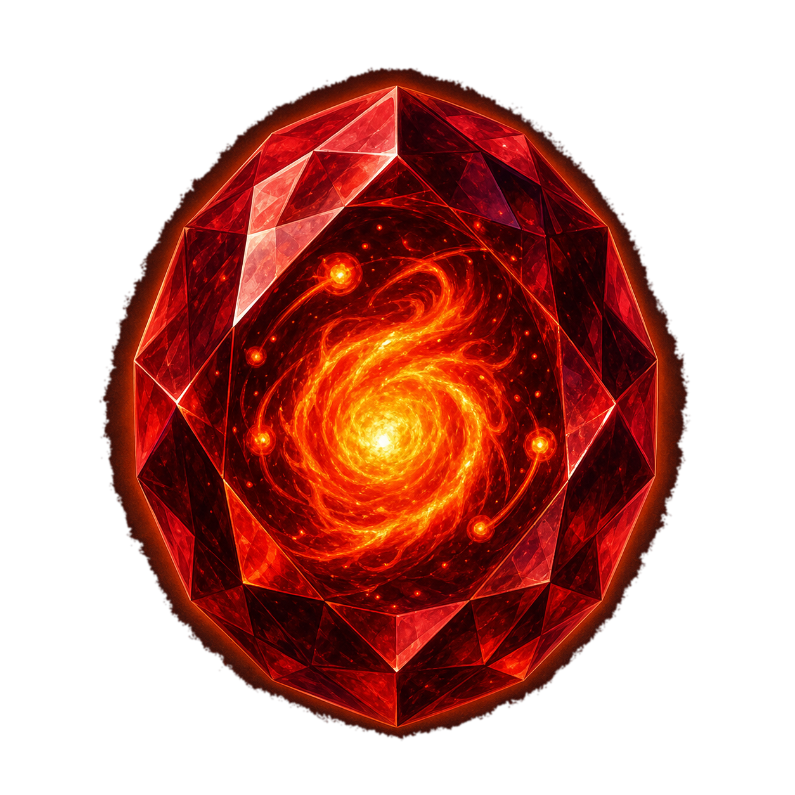<br><b>FIREBALL</b></td>
<td align="center">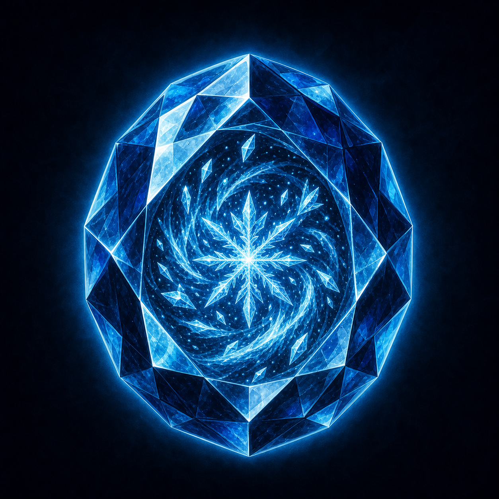<br><b>ICE SHARD</b></td>
<td align="center">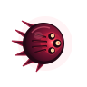<br><b>RIFT ENEMY</b></td>
</tr>
</table>

</div>

---

## // ABOUT

**GodotVSCodex** is an experimental top-down action game built in **Godot 4.7**.

The project is used as a live playground for pushing combat systems, rendering, UI, itemization, elemental effects, enemy density, and AI-assisted development without reducing the game to a tiny tech demo.

The current design sits somewhere between a survival-action game and an ARPG: automatic attacks, socketable skill/support gems, equipment, afflictions, bosses, loot, upgrades, and large enemy waves.

---

## // CURRENT SYSTEMS

- Automatic projectile combat with homing, pierce, explosions, knockback, and multi-projectile support
- **Fireball** with Burning stacks and stack explosions
- **Ice Shard** with Chill, Freeze buildup, and full Freeze
- **Chain Lightning** with chaining and Shock vulnerability
- Socketable **skill gems** and **support gems**
- Equipment inventory with weapon, armor, boots, implant, jewelry, core, and other slots
- Rarity tiers from Common through Mythic
- Boss waves with charge attacks, projectiles, reinforcements, and orbiting minions
- GPU/MultiMesh enemy rendering for large crowds
- XP, leveling, upgrades, loot drops, damage numbers, health bars, and run statistics
- Dash system with three rechargeable charges
- Challenge / achievement tracking
- Adjustable game speed, rendering scale, camera zoom, effects, and controls

---

## // SKILL GEMS

<table>
<tr>
<td align="center" width="25%">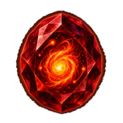<br><b>Fireball</b><br><sub>Fire • Projectile • AOE • Duration</sub></td>
<td align="center" width="25%">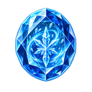<br><b>Ice Shard</b><br><sub>Cold • Projectile • Duration</sub></td>
<td align="center" width="25%">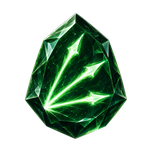<br><b>Greater Volley</b><br><sub>More projectiles</sub></td>
<td align="center" width="25%">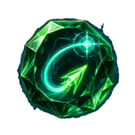<br><b>Heatseeking</b><br><sub>Homing projectiles</sub></td>
</tr>
<tr>
<td align="center">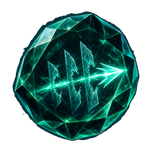<br><b>Piercing</b><br><sub>Additional penetration</sub></td>
<td align="center">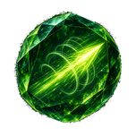<br><b>Swift Projectiles</b><br><sub>Faster projectiles</sub></td>
<td align="center">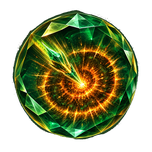<br><b>Impact Nova</b><br><sub>Larger impact radius</sub></td>
<td align="center"><br><b>Afflictions</b><br><sub>Burn • Chill • Freeze • Shock</sub></td>
</tr>
</table>

---

## // EQUIPMENT

<table>
<tr>
<td align="center">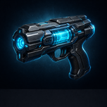<br><b>Pulse Pistol</b></td>
<td align="center">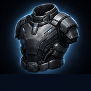<br><b>Plated Shell</b></td>
<td align="center">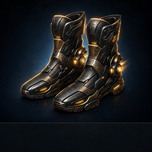<br><b>Runner Boots</b></td>
<td align="center">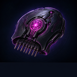<br><b>Neural Implant</b></td>
</tr>
</table>

Items can carry sockets, rarity, base modifiers, and persistent rolled modifiers. Skill gems and compatible support gems combine into the active skill configuration.

---

## // CONTROLS

| Input | Action |
|---|---|
| **WASD** | Move |
| **Shift** | Dash |
| **I / Tab** | Inventory |
| **Space** | Toggle game speed |
| **P** | Pause |
| **Z** | Cycle camera zoom |

---

## // RUNNING THE PROJECT

### Godot

Open the repository in **Godot 4.7.x** and run:

`scenes/main/game.tscn`

or simply run the project with **F6/F5** from the editor.

### One-click test copy

The repository also includes:

`Update-And-Run.bat`

and

`Update-And-Test.bat`

These are intended to update a local test copy and launch or test the latest `main`.

---

## // AUTOMATED TESTS

Current regression scenes live in:

`tests/`

Including coverage for:

- crowd spacing
- Ice Shard
- Chain Lightning

The repo also contains a GitHub Actions smoke-test workflow for Godot startup/import validation.

---

## // PROJECT MAP

```text
assets/
  enemies/
  ui/

resources/
  gems/
  items/
  stats/

scenes/
  actors/
  combat/
  main/
  pickups/
  systems/
  ui/

scripts/
  core/
  data/
  items/

tests/
```

---

## // VISUAL IDENTITY

<div align="center">


<br><br>

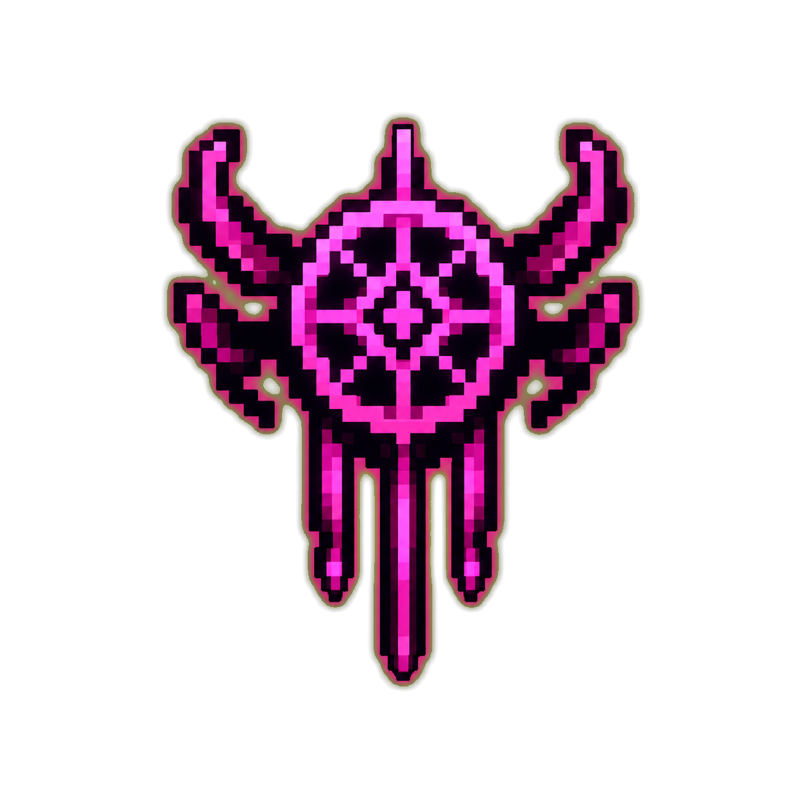
&nbsp;&nbsp;&nbsp;
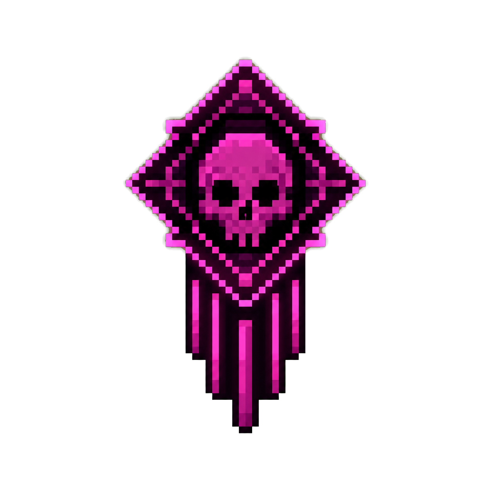

<br>

<sub>All artwork shown above is loaded directly from the actual game repository.</sub>

</div>

---

<div align="center">

**Built as a live experiment in game systems, rendering, and AI-assisted development.**

</div>
